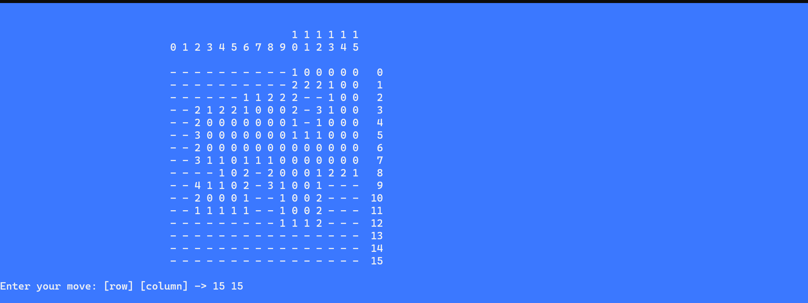
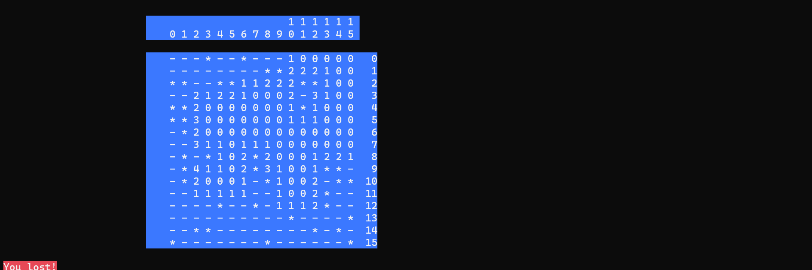

# Minesweeper Game

Minesweeper is a classic single-player puzzle game where the objective is to clear a rectangular board containing hidden mines without detonating any of them.

## Features

- Three difficulty levels: Beginner, Intermediate, and Advanced.
- Customizable grid size and number of mines.
- Colorful console-based user interface.
- Mines are randomly placed on the board.
- Player can reveal cells, mark potential mine locations, and win by revealing all safe cells.
- User-friendly input for making moves.

## How to Play

1. Choose the difficulty level (Beginner, Intermediate, or Advanced).
2. The game board will be displayed with cells hidden.
3. Enter your move by providing the row and column coordinates.
4. Avoid revealing a mine; otherwise, the game is over.
5. Continue making moves until you clear all safe cells or hit a mine.
## Requirements
Ensure you have a C++ compiler installed on your system. Compile the code using the following commands:
- g++ main.cpp
Run the executable using
- ./main
## Game Screenshots
   

   

## License
This Minesweeper game is provided under the MIT License.

Feel free to enjoy and modify the game as you like!
